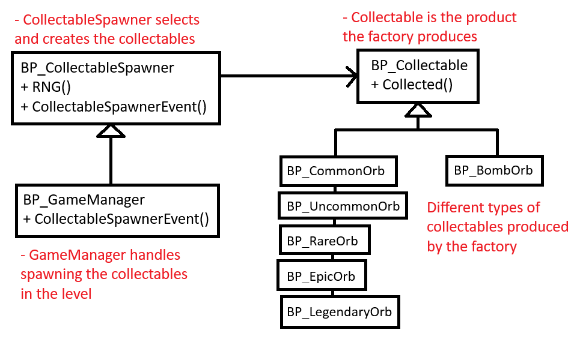
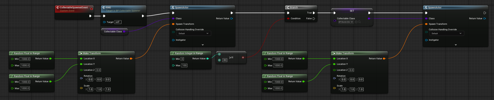
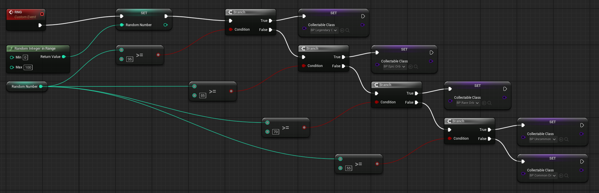
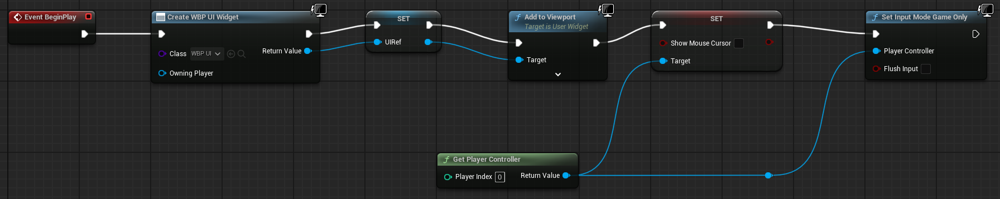
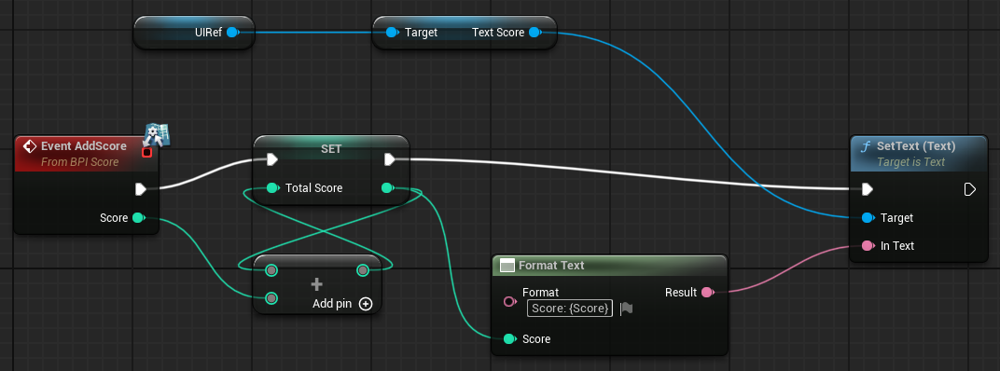
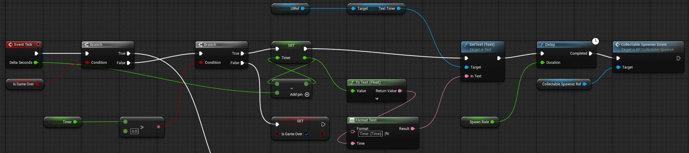
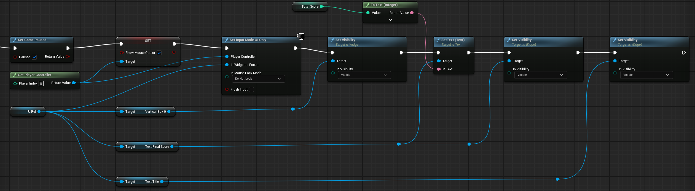
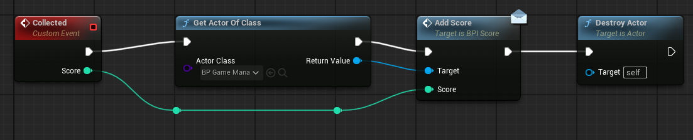
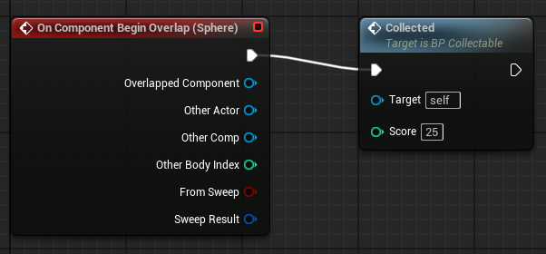
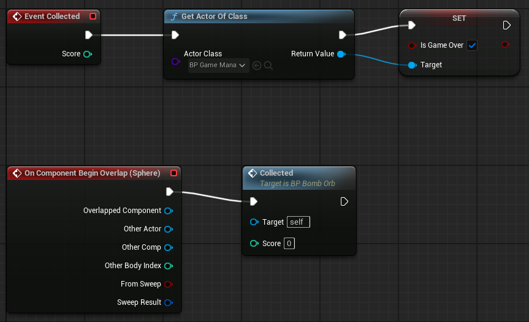

# Jaden Chen 100912701

## Orb Dash
Run around the platform collecting various orbs trying to get the highest score. The game ends when you run out of time or run into a bomb orb.

## Diagram

## Reflection Questions

#### What types of objects can your factory create?

The factory can create different types of orbs such as Rarity orbs that give different score ranging from Common -> Uncommon -> Rare -> Epic -> Legendary. It can also create Bomb orbs that will end the game if the player runs into one.

#### Why is the factory pattern a good choice for spawning these objects?

The factory pattern is a good choice for spawning these objects because it allows me to easily change the functionallity of the existing products while also making the creation of new products very simple. For example, When I had finished my game originally, I only had the Common, Uncommon, Rare, Epic, and Legendary Orbs spawning in the level. I figured out that I needed to add a bit of challenge to my game, and since I was using the factory design pattern, I created a new Orb which was the Bomb Orb with minimal effort.

## Blueprints

### BP_CollectableSpawner

### BP_GameManager

### BP_Collectable

### BP_CommonOrb / BP_UncommonOrb / BP_RareOrb / BP_EpicOrb / BP_LegendaryOrb (the only thing that changes is the score value)

### BP_BombOrb
