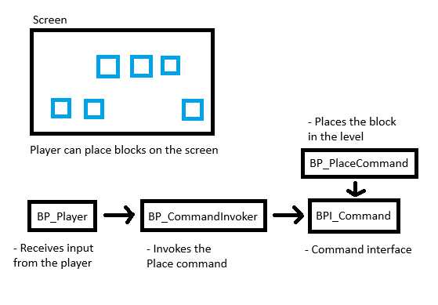

## Diagram

## Week 4 Reflection

This week, I tried to implement a block placement system using the control design pattern in Unreal Engine. During the activity, I ran into a major issue that prevented me from completing the system. I believe the issue was because I was using a more recent version of Unreal Engine (5.6) compared to the one used in the slides. I tried coming up with a few workarounds, but they didn't seem to work. I tried with the best of my ability to complete the activity, but I was unable to fully complete the command implementation, nor even start on implementing the DLL/plugin implementation.