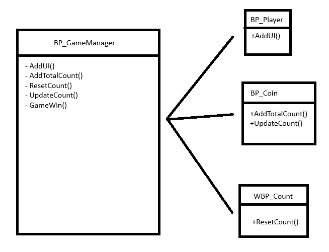

# Jaden Chen 100912701

## Simple Collectathon Game
In this game, the player jumps around the map collecting orbs. The win condition is collecting all the orbs on the map.

## Diagram

## Reflection Questions
The systems in my project that uses a Singleton includes Collectable count, Game Win condition, and User Interface. I figured using the Singleton pattern was the best choice considering how many different features I needed to add to my game such as, tracking total collectables on the map, current collectables the player has already collected, game win screen popping up as soon as the player collects every collectable on the map, and reseting both collectable counts to 0. By using a singleton to manage all of these features, the blueprints in my project only need a single access point for communication, preventing cross blueprint referencing and creating a tangled mess with my blueprints.