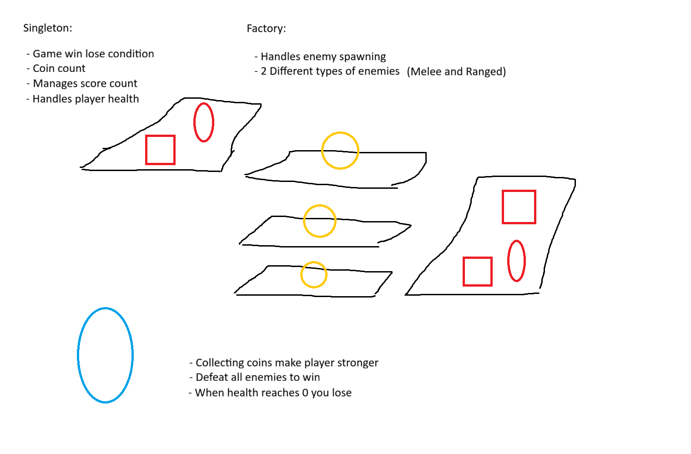

## Diagram

## Week 3 Reflection
In the 30 minutes I worked for, I managed to create a very simple game with a player controller, interactable enemies and collectables in Unreal Engine. I created psuedocode for a singleton that manages the player health, coin count, and score. I also made psudocode for a factory that handles spawning different types of enemies. I compared my work with Laith and it turns out that we both created a very similar game concepts, except he had to dodge the enemies instead of defeating them. He also created a singleton that managed the audio for his game. In my experience this week, I found that I need to practice more in Unreal Engine because creating the singleton and factory design patterns in Unreal Engine are a lot different compared to Unity and they are quite confusing since I was just introduced to them this week. Other than the struggles I faced, I had a better experience creating the game and diagram this week compared to last week, as I didnt even have enough time to create a diagram last week. I was surprised at how much work I got done in the 30 minutes. I took a different approach this week and that was to plan and create the diagram before starting to work on the actual game. I found that using this approach made my work flow a lot quicker as I didnt have to think as I go, and instead I just planned before, then executed.